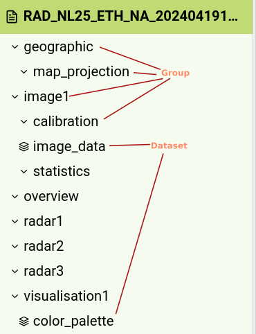

# Project

I have chosen for project proposal 1.

Fighting with h5 files seems to me like a fun challenge. It is definitely not the easiest file format to work with.
Luckily the great python ecosystem contains a library for these files, but they are inherently complex.
The live updates coming in from the government give a good reason to explore DAGs which interests me.

Two days ago the api also started returning .nc files.
I have not yet looked as deeply at .nc properly, but it is another binary format that contains metadata and vector data.
Expect another version of this document where I go into them more.

The goal of this project is to create a pipeline that takes in data from the pupsub api and combines it into a
simple-to-use vector dataset.
This dataset should then be easy to used to train machine learning models. Especially transformer models.

# Ease of access

The files in the dataset are not easy to access. You first need to make an account on the knmi.nl website. After this
you need to apply to get two different access tokens.
If you get accepted you can then use token 1 to subscribe to a stream where kmni publishes new data.
An item in this stream contains a link.
Once you got this link you can make a request to the link with token 2.
In the response of this request you get another link from which you can actually download the data.

I have mostly seen .h5 files. However, since a couple of days I have also seen .nc files.
I have not yet had the time to fully investigate the structure of .nc files. Expect an updated version of this
submission where this is described more.

# H5 file

To become familiar with H5 I read these resources:

- https://docs.fileformat.com/misc/h5/
- https://github.com/christianversloot/machine-learning-articles/blob/main/how-to-use-h5py-and-keras-to-train-with-data-from-hdf5-files.md
- https://docs.hdfgroup.org/hdf5/develop/_f_m_t3.html#AttributeMessage
- https://docs.hdfgroup.org/hdf5/develop/_f_m_t3.html

I also tried out the online h5 file viewer at https://myhdf5.hdfgroup.org/ which was very helpful for my understanding.

After reading these resources I made the following description of H5 in my own words:

## What is H5?

The H5 binary format is like a zip file. A file which contains other files.
Files inside an H5 file have two kinds. These two kinds are groups and datasets.
Each group and dataset has a name and is located in a certain path in the H5 file.

A group or dataset always contain a bit of json that describes the dataset or group.
A dataset is a multidimensional array of a homogeneous type. So for instance a matrix of only integers.
These datasets can be loaded as a numpy array.

A group can contain other groups and datasets. Datasets can not contain groups.

Groups and datasets can also contain attributes.
Attributes can be used for the metadata of a file, but also as small datasets that are attached to a file.
Attributes can contain many different types of data like stings, various types of numbers and more.
According to the HDF5 spec the data in a single attribute should not be larger than 64kb.



## H5 file format quality assessment

The fact that the data is in H5 format is good and bad for the quality of the data.
An H5 file should be good for quality because the format can store a massive amount of vectors in such a way that it is
efficient to load.
However, in practice it is not good for quality because a data scientist has to actually learn about HDF5 files before
they can use them.
From my experience you need a pretty good understanding of h5 files before you can actually use them.
The average data scientist did not learn about H5 files in their education.
Thus, the average data scientist will find it difficult and annoying to load this type of file and load the data into a
model.
There is a trade-off here between speed of loading and convenience.

What also does not help the quality of the data is that the data comes from the government in multiple h5 files.

# The switch to NC files

During the course of this project it seems that the knmi has switched their file format from .h5 to .nc files.
At first, I thought that the api could just also return h5 files but after running a that listens to the data from knmi
for two days I observed no further .h5 files any more. So what is an nc file?

## Nc file format

To understand the NC file format I consulted the following resources:

- https://unidata.github.io/netcdf4-python/
- https://stackoverflow.com/questions/1075074/opinions-on-netcdf-vs-hdf5-for-storing-scientific-data
- https://nctoolkit.readthedocs.io/en/v0.1.2/

The NC (NetCDF) a binary file format that is implemented on top of HD5. As such NC is also a binary data format used to
store multidimensional arrays.
The big difference between NetCDF and HD5 is NetCDF is not hierarchical. This means that there are no groups in groups
with HD5 but only datasets.
`.nc` is like a zip file without any directories. A tree with only leafs All the dataset are at the root of the tree.
This means that any library that can load HD5 should also be able to load NetCDF files.
This was indeed the case for the web visualizer for h5 I used earlier.

To illustrate, an h5 file would give you something like this:

```text
/
  /weather
    /rain
        - vector
        - image
    /temperature 
        - vector
        - image
```

A nc file instead gives you something like this:

```text
/
- Rain vector
- Rain image
- Temperature vector
- Temperature image
```

### Loading nc

Even though every h5 loader should be able to load nc files I looked on the internet for (python) tools specifically
made for nc files.
At first, I found something called `nctoolkit` (linked above). This had an amazing documentation, but it was sadly
unable to load any files for me.

Secondly from [this stack overflow post](https://stackoverflow.com/questions/36360469/read-nc-netcdf-files-using-python)
I
found [netCDF4](netCDF4) which also has [great documentation](https://unidata.github.io/netcdf4-python/)

Using this library I could load an .nc file like this:

```python
import netCDF4

db = netCDF4.Dataset("KMDS__OPER_P___10M_OBS_L2_202405161720.nc")
print(db)
print(db.variables)
```

## Exploring the NC files

At this point using the command `ls *.nc -l | wc -l` I found out that I had downloaded 83 files.

Next I wrote a program check the dataset names within an .nc file. You can find the `iter_nc_files` iterator in the
appendix.

```python
from collections import defaultdict
import glob, netCDF4

counts = defaultdict(int)
file_count = 0
for db in iter_nc_files():
    for key in db.variables:
        counts[key] += 1
    file_count += 1
print(f"Iterated over {file_count} files. ")
print(f"There are {len(counts)} different keys with all the files")
print(f"Each key appearance counts:\n", counts)
```

Find the full printed result in the appendix.
The output showed me a lot of information about these .nc files.

Within the 85 files I collected so far there were 103 different databases names found.
Every database name appeared 85 times in the fields.

It seemed that at least every .nc file now has the same database names.
This was nice to see because with the h5 files I had noticed differences in the file system layout between different
files.

### Making a Table of contents

I proceeded to investigate each database further in . I found out that each database actually has some very useful attributes.
Namely `comment`, `long name`, `unit`, `size`, `shape` and `datatype`.

The comments are actually very detailed. An example of a comment for the `zm` dataset:

zm Note: The sensor is not installed at equal heights at all types of measurement sites: At 'AWS' sites the device is installed at 1.80m. At 'AWS/Aerodrome' and 'Mistpost' (note that this includes site Voorschoten (06215) which is 'AWS/Mistpost') the device is installed at 2.50m elevation. Exceptions are Berkhout AWS (06249), De Bilt AWS (06260) and Twenthe AWS (06290) where the sensor is installed at 2.50m.


Using the [toMark](https://pypi.org/project/tomark/) package I generated a table with all the database names within each nc file.

Some interesting things to take away from this table is that each unit was either a primitive type or an array of 69 values. 
This is nice because that means that the lengths of the arrays will be the same.

#### Units 

After making that table turned the units column into a set which left me with these units:

- '%',    '1', 'J cm-2', 'W m-2',
- 'cd m-2', 'code', 'degree',
- 'degrees Celsius', 'degrees_east', 'degrees_north',
- 'ft', 'hPa', 'm',
- 'm s-1', 'min', 'mm',
- 'mm h-1', 'octa',
- 'sec', 'seconds since 1950-01-01 00:00:00'

### Iso database

After this I also looked into the `iso_dataset` dataset. 
This contained a lot of interesting data.

One value of a dataset looked like this:

```text
|S1 iso_dataset()
    title: KMDS__OPER_P___10M_OBS_L2
    abstract: Most recent 10 minute in situ observations of the Dutch meteorological observation network
    status: ongoing
    type: dataset
    uid: c3a312e2-2d8f-440b-ae7d-3406c9fe2f77
    topic: climatology, meteorology, atmosphere
    keyword: temperature, pressure, relative humidity, visibility, wind speed, wind direction, wind gust
    max-x: 7.4
    min-x: -68.5
    max-y: 55.7
    min-y: 12.0
    temporal_extent: 1950-01-01 and ongoing
    date: 2023-07-01
    dateType: publication date
    statement: KNMI collects observations from automatic weather stations situated in the 
                Netherlands and BES islands on locations such as aerodromes and North Sea platforms. 
                In addition, wind data from 5 KNMI wind poles are included. 
                The weather stations report every 10 minutes meteorological parameters such as temperature, 
                relative humidity, wind, air pressure, visibility, precipitation and cloud cover. 
                The number of parameters differs per station.
    code: 4326
    codeSpace: EPSG
    accessConstraints: No limitations
    useLimitation: No use limitations
    organisationName_dataset: Royal Netherlands Meteorological Institute (KNMI)
    email_dataset: opendata@knmi.nl
    role_dataset: pointOfContact
    metadata_id: 0ebaef73-6bff-4a25-a86b-6bf53bc4c505
    organisationName_metadata: Royal Netherlands Meteorological Institute (KNMI)
    role_metadata: pointOfContact
    email_metadata: opendata@knmi.nl
    url_metadata: https://dataplatform.knmi.nl
    datestamp: 2014-07-23
    language: eng
    metadataStandardName: ISO 19115
    metadataStandardNameVersion: Nederlandse metadatastandaard op ISO 19115 voor geografie 1.2
unlimited dimensions: 
current shape = ()
filling on, default _FillValue of   used
```

Most importantly the `metadataStandardName` field.

This seems to indicate that there is some iso standard that this nc file is following. 
I looked for this standard and found the following.

This standard could be the reason for the high quality of this data. 

I found a full version of the standard [here](https://docs.geostandaarden.nl/md/mdprofiel-iso19115/)
But this seems to describe a newer version then the standard (2.1.0) than the one in use by the nc files I get which is 1.2.

This standard describes a schema for metadata ....

### Data quality assessment

The quality of the data itself is high.
It comes from scientific measurement tools.
The data itself is vectors of climate data with are basically just lists of lists of numbers along with some meta data
describing the list of lists of numbers.
Description contain units of data like for instance pressure units or temperature in c.
There do not seem to be null values. This makes sense because it is mostly just the raw measurements from the weather
station sensors distributed over the Netherlands.
This makes all parts of the data seems to be usable and in theory very suitable for machine learning models.
Machine learning models do well with vectors.

However, accessing the data is hard as I have hopefully described.
You first have to connect to the api which is quite some steps and then extract the data from these file formats that I
have never seen before which is also not trivial.

# Improving the Quality

The only data quality issue that I could find with the data itself is that it uses unix time stamps for dates instead of the true dataformat which is the iso (??) one.
It was in the unitttttt
I shall add a field to each dataset with the iso version of the date.

Keep the int cause for ease of use. Include the table on the website.

I will improve the quality of the data by making it much easier to load.

Data loader torch. You can give keys to load and a date range.
Pipeline to add the new data. 
I think we shall have a parquet file for each key and one parquet file with all the data of that per day. At end of day run pipeline to write the new files.

The data is served through a dataloader which can give a time series per location sounds like a good idea.
From -> till, keys. The label is the time!.

Finish this one in the train.

3 = The wrangeling. So making the setup to build the seperate parquet files. 
We should probably look into the pipeline thing though!

3 = serving. The dataloader frontent from storage. There is new data but old data actually never changes!!! PERFECt.
MAKE THIS PART OF THE PIPeLine.

# Appendix

## `iter_nc_files` iterator

This is a python iterator that iterates over all .nc files and yields opened versions of them.

```py
import glob, netCDF4


def iter_nc_files():
    for file in glob.iglob("*.nc"):
        db = netCDF4.Dataset(file)
        try:
            yield db
        finally:
            db.close()
```

Result of exploration program 1.

```text
Iterated over 85 files. 
There are 103 different keys with all the files
Each key appearance counts: 
defaultdict(<class 'int'>, {'station': 85, 'time': 85, 
'wsi': 85, 'stationname': 85, 'lat': 85, 'lon': 85, 
'height': 85, 'D1H': 85, 'dd': 85, 'dn': 85, 'dr': 85, 
'dsd': 85, 'dx': 85, 'ff': 85, 'ffs': 85, 'fsd': 85, 
'fx': 85, 'fxs': 85, 'gff': 85, 'gffs': 85, 'h': 85, 
'h1': 85, 'h2': 85, 'h3': 85, 'hc': 85, 'hc1': 85, 'hc2': 85, 
'hc3': 85, 'n': 85, 'n1': 85, 'n2': 85, 'n3': 85, 'nc': 85, 
'nc1': 85, 'nc2': 85, 'nc3': 85, 'p0': 85, 'pp': 85, 'pg': 85, 
'pr': 85, 'ps': 85, 'pwc': 85, 'Q1H': 85, 'Q24H': 85, 'qg': 85, 'qgn': 85, 
'qgx': 85, 'qnh': 85, 'R12H': 85, 'R1H': 85, 'R24H': 85, 'R6H': 85, 
'rg': 85, 'rh': 85, 'rh10': 85, 'Sav1H': 85, 'Sax1H': 85, 'Sax3H': 85, 
'Sax6H': 85, 'sq': 85, 'ss': 85, 'Sx1H': 85, 'Sx3H': 85, 'Sx6H': 85, 't10': 85, 
'ta': 85, 'tb': 85, 'tb1': 85, 'Tb1n6': 85, 'Tb1x6': 85, 'tb2': 85, 'Tb2n6': 85, 
'Tb2x6': 85, 'tb3': 85, 'tb4': 85, 'tb5': 85, 'td': 85, 'td10': 85, 'tg': 85, 'tgn': 85, 
'Tgn12': 85, 'Tgn14': 85, 'Tgn6': 85, 'tn': 85, 'Tn12': 85, 'Tn14': 85, 'Tn6': 85, 
'tsd': 85, 'tx': 85, 'Tx12': 85, 'Tx24': 85, 'Tx6': 85, 'vv': 85, 'W10': 85, 'W10-10': 85, 
'ww': 85, 'ww-10': 85, 'zm': 85, 'iso_dataset': 85, 'product': 85, 'projection': 85, 
'nhc': 85, 'za': 85})
```

| name        | Long name                                           | size | shape   | units                             | type    |
|-------------|-----------------------------------------------------|------|---------|-----------------------------------|---------|
| station     | Station id                                          | 69   | (69,)   | None                              | string  |
| time        | time of measurement                                 | 1    | (1,)    | seconds since 1950-01-01 00:00:00 | float64 |
| wsi         | Station wsi                                         | 69   | (69,)   | None                              | string  |
| stationname | Station name                                        | 69   | (69,)   | None                              | string  |
| lat         | station  latitude                                   | 69   | (69,)   | degrees_north                     | float64 |
| lon         | station longitude                                   | 69   | (69,)   | degrees_east                      | float64 |
| height      | Station height                                      | 69   | (69,)   | m                                 | float64 |
| D1H         | Rainfall Duration in last Hour                      | 69   | (69, 1) | min                               | float64 |
| dd          | Wind Direction 10 Min Average with MD               | 69   | (69, 1) | degree                            | float64 |
| dn          | Wind Direction Sensor 10 Min Minimum with MD        | 69   | (69, 1) | degree                            | float64 |
| dr          | Precipitation Duration (Rain Gauge) 10 Min Sum      | 69   | (69, 1) | sec                               | float64 |
| dsd         | Wind Direction 10 Min Std Dev with MD               | 69   | (69, 1) | degree                            | float64 |
| dx          | Wind Direction Sensor 10 Min Maximum with MD        | 69   | (69, 1) | degree                            | float64 |
| ff          | Wind Speed at 10m 10 Min Average with MD            | 69   | (69, 1) | m s-1                             | float64 |
| ffs         | Wind Speed Sensor 10 Min Average with MD            | 69   | (69, 1) | m s-1                             | float64 |
| fsd         | Wind Speed 10 Min Std Dev with MD                   | 69   | (69, 1) | m s-1                             | float64 |
| fx          | Wind Gust at 10m Maximum last 10 Min Interval       | 69   | (69, 1) | m s-1                             | float64 |
| fxs         | Wind Gust Sensor Maximum last 10 Min Interval       | 69   | (69, 1) | m s-1                             | float64 |
| gff         | Wind Gust at 10m 10 Min Maximum with MD             | 69   | (69, 1) | m s-1                             | float64 |
| gffs        | Wind Gust Sensor 10 Min Maximum with MD             | 69   | (69, 1) | m s-1                             | float64 |
| h           | Cloud Base                                          | 69   | (69, 1) | ft                                | float64 |
| h1          | Cloud Base First Layer                              | 69   | (69, 1) | ft                                | float64 |
| h2          | Cloud Base Second Layer                             | 69   | (69, 1) | ft                                | float64 |
| h3          | Cloud Base Third Layer                              | 69   | (69, 1) | ft                                | float64 |
| hc          | Cloud Base Ceilometer Algorithm                     | 69   | (69, 1) | ft                                | float64 |
| hc1         | Cloud Base Ceilometer First Layer                   | 69   | (69, 1) | ft                                | float64 |
| hc2         | Cloud Base Ceilometer Second Layer                  | 69   | (69, 1) | ft                                | float64 |
| hc3         | Cloud Base Ceilometer Third Layer                   | 69   | (69, 1) | ft                                | float64 |
| n           | Total cloud cover                                   | 69   | (69, 1) | octa                              | float64 |
| n1          | Cloud Amount First Layer                            | 69   | (69, 1) | octa                              | float64 |
| n2          | Cloud Amount Second Layer                           | 69   | (69, 1) | octa                              | float64 |
| n3          | Cloud Amount Third Layer                            | 69   | (69, 1) | octa                              | float64 |
| nc          | Total Cloud Cover Ceilometer                        | 69   | (69, 1) | octa                              | float64 |
| nc1         | Cloud Amount Ceilometer First Layer                 | 69   | (69, 1) | octa                              | float64 |
| nc2         | Cloud Amount Ceilometer Second Layer                | 69   | (69, 1) | octa                              | float64 |
| nc3         | Cloud Amount Ceilometer Third Layer                 | 69   | (69, 1) | octa                              | float64 |
| p0          | Air Pressure at Station Level 1 Min Average         | 69   | (69, 1) | hPa                               | float64 |
| pp          | Air Pressure at Sea Level 1 Min Average             | 69   | (69, 1) | hPa                               | float64 |
| pg          | Precipitation Intensity (PWS) 10 Min Average        | 69   | (69, 1) | mm h-1                            | float64 |
| pr          | Precipitation Duration (PWS) 10 Min Sum             | 69   | (69, 1) | sec                               | float64 |
| ps          | Air Pressure at Sensor Level 10 Min Average         | 69   | (69, 1) | hPa                               | float64 |
| pwc         | Corrected Precipitation Type 10 Min Maximum         | 69   | (69, 1) | code                              | float64 |
| Q1H         | Global Radiation 1 Hour Sum                         | 69   | (69, 1) | J cm-2                            | float64 |
| Q24H        | Global Radiation 24 Hour Sum                        | 69   | (69, 1) | J cm-2                            | float64 |
| qg          | Global Solar Radiation 10 Min Average               | 69   | (69, 1) | W m-2                             | float64 |
| qgn         | Global Solar Radiation 10 Min Minimum               | 69   | (69, 1) | W m-2                             | float64 |
| qgx         | Global Solar Radiation 10 Min Maximum               | 69   | (69, 1) | W m-2                             | float64 |
| qnh         | QNH 1 Min Average                                   | 69   | (69, 1) | hPa                               | float64 |
| R12H        | Rainfall in last 12 Hours                           | 69   | (69, 1) | mm                                | float64 |
| R1H         | Rainfall in last Hour                               | 69   | (69, 1) | mm                                | float64 |
| R24H        | Rainfall in last 24 Hours                           | 69   | (69, 1) | mm                                | float64 |
| R6H         | Rainfall in last 6 Hours                            | 69   | (69, 1) | mm                                | float64 |
| rg          | Precipitation Intensity (Rain Gauge) 10 Min Average | 69   | (69, 1) | mm h-1                            | float64 |
| rh          | Relative Humidity 1.5m 1 Min Average                | 69   | (69, 1) | %                                 | float64 |
| rh10        | Relative Humidity 10 Min Average                    | 69   | (69, 1) | %                                 | float64 |
| Sav1H       | Wind Speed Average last 1 Hour                      | 69   | (69, 1) | m s-1                             | float64 |
| Sax1H       | Wind Speed Maximum last 1 Hour                      | 69   | (69, 1) | m s-1                             | float64 |
| Sax3H       | Wind Speed Maximum last 3 Hours                     | 69   | (69, 1) | m s-1                             | float64 |
| Sax6H       | Wind Speed Maximum last 6 Hours                     | 69   | (69, 1) | m s-1                             | float64 |
| sq          | Squall Indicator                                    | 69   | (69, 1) | code                              | float64 |
| ss          | Sunshine Duration                                   | 69   | (69, 1) | min                               | float64 |
| Sx1H        | Wind Gust Maximum last 1 Hour                       | 69   | (69, 1) | m s-1                             | float64 |
| Sx3H        | Wind Gust Maximum last 3 Hours                      | 69   | (69, 1) | m s-1                             | float64 |
| Sx6H        | Wind Gust Maximum last 6 Hours                      | 69   | (69, 1) | m s-1                             | float64 |
| t10         | Ambient Temperature 10 Min Average                  | 69   | (69, 1) | degrees Celsius                   | float64 |
| ta          | Ambient Temperature 1.5m 1 Min Average              | 69   | (69, 1) | degrees Celsius                   | float64 |
| tb          | Wet Bulb Temperature 1.5m 10 Min Average            | 69   | (69, 1) | degrees Celsius                   | float64 |
| tb1         | Soil Temperature -5cm 10 Min Average                | 69   | (69, 1) | degrees Celsius                   | float64 |
| Tb1n6       | Soil Temperature -5cm Minimum last 6 Hours          | 69   | (69, 1) | degrees Celsius                   | float64 |
| Tb1x6       | Soil Temperature -5cm Maximum last 6 Hours          | 69   | (69, 1) | degrees Celsius                   | float64 |
| tb2         | Soil Temperature -10cm 10 Min Average               | 69   | (69, 1) | degrees Celsius                   | float64 |
| Tb2n6       | Soil Temperature -10cm Minimum last 6 Hours         | 69   | (69, 1) | degrees Celsius                   | float64 |
| Tb2x6       | Soil Temperature -10cm Maximum last 6 Hours         | 69   | (69, 1) | degrees Celsius                   | float64 |
| tb3         | Soil Temperature -20cm 10 Min Average               | 69   | (69, 1) | degrees Celsius                   | float64 |
| tb4         | Soil Temperature -50cm 10 Min Average               | 69   | (69, 1) | degrees Celsius                   | float64 |
| tb5         | Soil Temperature -100cm 10 Min Average              | 69   | (69, 1) | degrees Celsius                   | float64 |
| td          | Dew Point Temperature 1.5m 1 Min Average            | 69   | (69, 1) | degrees Celsius                   | float64 |
| td10        | Dew Point Temperature 10 Min Average                | 69   | (69, 1) | degrees Celsius                   | float64 |
| tg          | Grass Temperature 10cm 10 Min Average               | 69   | (69, 1) | degrees Celsius                   | float64 |
| tgn         | Grass Temperature 10cm 10 Min Minimum               | 69   | (69, 1) | degrees Celsius                   | float64 |
| Tgn12       | Grass Temperature Minimum last 12 Hours             | 69   | (69, 1) | degrees Celsius                   | float64 |
| Tgn14       | Grass Temperature Minimum last 14 Hours             | 69   | (69, 1) | degrees Celsius                   | float64 |
| Tgn6        | Grass Temperature Minimum last 6 Hours              | 69   | (69, 1) | degrees Celsius                   | float64 |
| tn          | Ambient Temperature 1.5m 10 Min Minimum             | 69   | (69, 1) | degrees Celsius                   | float64 |
| Tn12        | Air Temperature Minimum last 12 Hours               | 69   | (69, 1) | degrees Celsius                   | float64 |
| Tn14        | Air Temperature Minimum last 14 Hours               | 69   | (69, 1) | degrees Celsius                   | float64 |
| Tn6         | Air Temperature Minimum last 6 Hours                | 69   | (69, 1) | degrees Celsius                   | float64 |
| tsd         | SIAM Ambient Temperature 10 Min Average Std Dev     | 69   | (69, 1) | degrees Celsius                   | float64 |
| tx          | Ambient Temperature 1.5m 10 Min Maximum             | 69   | (69, 1) | degrees Celsius                   | float64 |
| Tx12        | Air Temperature Maximum last 12 Hours               | 69   | (69, 1) | degrees Celsius                   | float64 |
| Tx24        | Air Temperature Maximum last 24 Hours               | 69   | (69, 1) | degrees Celsius                   | float64 |
| Tx6         | Air Temperature Maximum last 6 Hours                | 69   | (69, 1) | degrees Celsius                   | float64 |
| vv          | Horizontal Visibility 10 Min Average                | 69   | (69, 1) | m                                 | float64 |
| W10         | Past Weather Indicator                              | 69   | (69, 1) | code                              | float64 |
| W10-10      | Past Weather Indicator for Previous 10 Min Interval | 69   | (69, 1) | code                              | float64 |
| ww          | wawa Weather Code                                   | 69   | (69, 1) | code                              | float64 |
| ww-10       | wawa Weather Code for Previous 10 Min Interval      | 69   | (69, 1) | code                              | float64 |
| zm          | Meteorological Optical Range 10 Min Average         | 69   | (69, 1) | m                                 | float64 |
| iso_dataset | None                                                | 1    | ()      | None                              | S1      |
| product     | ADAGUC Data Products Standard                       | 1    | ()      | 1                                 | S1      |
| projection  | None                                                | 1    | ()      | None                              | S1      |
| nhc         | Low and Middle Cloud Amount Ceilometer              | 1    | ()      | octa                              | S1      |
| za          | Background Luminance 10 Min Average                 | 1    | ()      | cd m-2                            | S1      |

I think S1 is a record type. 
