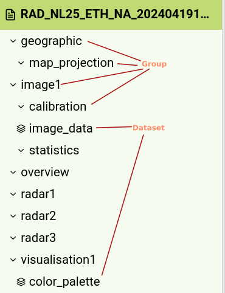

# Project 

I have chosen for project proposal 1. 
Fighting with h5 files seems to me like a fun challenge. It is definitely not the easiest file format to work with. 
Luckily the great python ecosystem contains a library for these files but they are inherently complex.
The live updates coming in from the government give a good reason to explore DAGs which interests me. 

The api also seems to return nc files as well.

# Quality

## H5 file

To become familiar with H5 I read these resources:

- https://docs.fileformat.com/misc/h5/
- https://github.com/christianversloot/machine-learning-articles/blob/main/how-to-use-h5py-and-keras-to-train-with-data-from-hdf5-files.md
- https://docs.hdfgroup.org/hdf5/develop/_f_m_t3.html#AttributeMessage
- https://docs.hdfgroup.org/hdf5/develop/_f_m_t3.html
 
I also tried out the online h5 file viewer at https://myhdf5.hdfgroup.org/ which was very helpful for my understanding. 

After reading these resources I made the following description of H5 in my own words:

### What is H5?

The H5 binary format is like a zip file. A file which contains other files. 
Files inside an H5 file have two kinds. These two kinds are groups and datasets. 
Each group and dataset has a name and is located in a certain path in the H5 file. 

A group or dataset always contain a bit of json that describes the dataset or group.
A dataset is a multidimensional array of a homogeneous type. So for instance a matrix of only integers. 
These datasets can be loaded as a numpy array. 

A group can contain other groups and datasets. Datasets can not contain groups.

Groups and datasets can also contain attributes. 
Attributes can be used for the metadata of a file, but also as small datasets that are attached to a file.
Attributes can contain many different types of data like stings, various types of numbers and more.
According to the HDF5 spec the data in a single attribute should not be larger than 64kb.

### H5 file format quality assessment

The fact that the data is in H5 format is good and bad for the quality of the data. 
An H5 file should be good for quality because the format can store a massive amount of vectors in such a way that it is efficient to load. 
However, in practice it is not good for quality because a data scientist has to actually learn about HDF5 files before they can use them.
From my experience you need a pretty good understanding of h5 files before you can actually use them. 
The average data scientist did not learn about H5 files in their education. 
Thus, the average data scientist will find it difficult and annoying to load this type of file and load the data into a model. 
There is a trade-off here between speed of loading and convenience.

What also does not help the quality of the data is that the data comes from the government in multiple h5 files. 

### Nc file format

### Data quality assessment 

When determining the quality of a dataset, there are many questions you could ask yourself. 
We have compiled a list of common questions below, but depending on the dataset you have chosen, other questions may be applicable.

The quality of the 

Example questions:

    Are there any NULL values, and if so, how many? Are they correctly encoded as NULL or is there a placeholder (like 0 or 999)?

    Are all columns usable, or just a few?

    Does the dataset contain outliers? How can you detect them and can they be corrected?

    If the data contains units, for example, for temperature, is it Celsius or Fahrenheit? Do the values make sense for that unit?

    How are values encoded? For instance, which date formats (and which time zones) are used? Are values properly normalised?

    If the data contains text, what is the encoding? For example: UTF8 or ASCII.

    Are the values plausible and do they make sense? For example, if the data contains addresses or phone numbers, do they resemble actual, real life locations and phone numbers?

    When using multiple data sources, can you find clear keys on which to join the data? Are these keys represented in the same way in both datasets? For example, one dataset could represent a US state as CA, while the other denotes it as California.

    Do all files have the same number of columns, do the types match? Is there a clear schema? Are there duplicate fields in records?

    Are the types correct for the values they represent? A classic example is a table column with only integer values, but with a string type.

    Do the digits in the file have separators? Are there separators for the decimals, and for every 1000. For example, is 1 million written as 1,000,000.0 or as 1.000.000,0? Are the separators consistent?

    If the data has to be parsed, is it easy to parse? For example, does the CSV have consistent separators and quoted strings? Or in the case of HTML, is the HTML incorrect or incomplete?

# Improving the Quality

Merge new h5 files into a single big one. 
Also creating a vector database that can be easily be loaded by into machine learning systems. 
If there is only one database per h5 file it will be cool to transform them into parquet files as well. 

If the quality of the data is lacking in any regard, how do you plan to clean it? Which tools are you going to use? Do you need to perform any transformations, or normalizations to make sense of the data, or to prepare it for your intended use-case? Example tools to process data are:

Initially, your weekly assignments will be graded on a pass/fail basis. The final report consists of all (polished) assignments. In the final report, the part on quality assessment will be graded based on the following scale:

    Only very minimal quality checks were performed, obvious quality risks were ignored, and/or no explanation was given for quality-related observations.

    Some quality assessment was performed, but certain quality issues might remain; there is no guarantee the data is now fully cleaned. Observed quality issues are not properly resolved.

    The data quality was assessed decently, but no issues were found. We can conclude that the dataset is clean, but only because it has already been cleaned beforehand. Alternatively, the dataset does include quality issues which were identified, but they have not been fixed.

    The data quality was assessed in depth, and some quality issues were recognized and resolved.

    The quality of the data was assessed exhaustively and creatively, i.e. all columns or parts of the dataset have been inspected in a meaningful manner. Existing quality issues could be explained and were resolved neatly.
