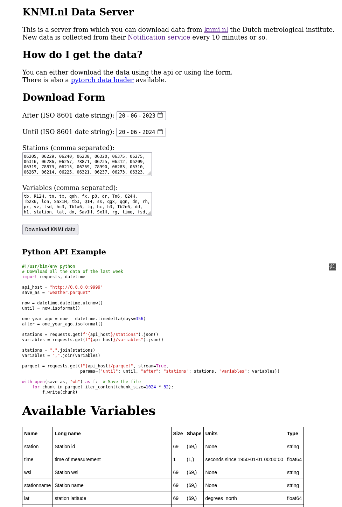
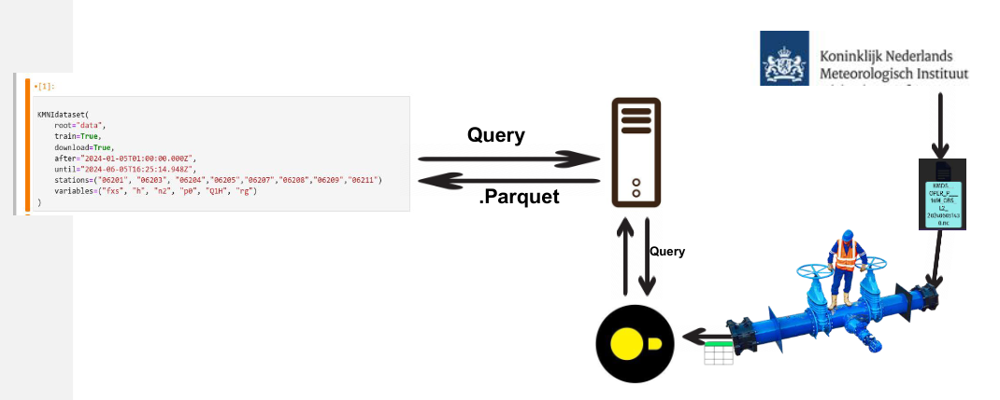
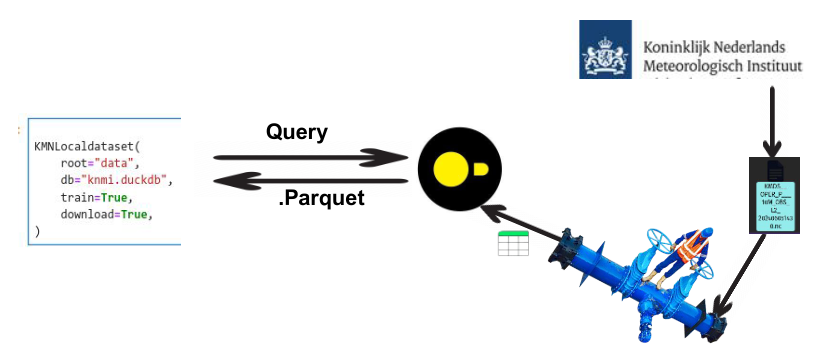

---

\pagebreak

# Serving 

Using the pipeline developed in the previous report the data is now stored in the Duckdb database. 
The pipeline also updates the database every 10 minutes with new data coming in from KNMI.nl.

As mentioned before I think the best way for the data scientist to interact with the data is a dataloader.
However, where does the dataloader get the data from?
To actually get the data, the dataloader will need to download it from the api that is built around the database. 
I think a simple api is the best fit here as it allows to abstract the duckdb database and KNMI pipeline into a simple interface for the dataloader.  

## The API

The api itself (created using [bottle](https://bottlepy.org/docs/dev/)) is simple. You can query the '/parquet' endpoint with a get request to export parquet files besides programmatically from the api. 
The get request takes the following query parameters.

| Query Parameter | Type                                          | Description                                                                                               |
|-----------------|-----------------------------------------------|-----------------------------------------------------------------------------------------------------------|
| after           | ISO 8601 date string                          | This parameter allows you to specify the beginning  of the time range for which you want to retrieve data |                                          |                                                                                                                           |
| until           | ISO 8601 date string                          | This parameter allows you to specify the end of the time range for which you want to retrieve data        |                                                                                                                           |
| stations        | String of comma separated station names       | This parameter allows you to specify from which stations you want to download data                        |
| variables       | String of comma separated variable names      | This parameter allows you to specify which variables you want to download.                                |

I also added the `/stations` and `/variables` endpoints.
These endpoints allow you to GET the available variable and station names programmatically (json lists).
Finally, I added the `/ping` endpoint to check availability of the api.

The api was now complete. But how would people know how to use it? 
To solve that issue I created a static html page at the root of the api `"/"`. You can find a picture of this page in Figure 1.
On this page I explained the api, the query parameters, and I provided an example in Python of how to download data from the api.
I also added the table from the previous report with all the variable descriptions.

At this point I realized that more ways to access the data would be better than just one way. 
In this spirit I added a download form to the page at `"/"`. 
This form is another way that people can download the parquet files. 
I think having a form greatly increases the accessibility of the data. 



Find the code for the api in the appendix. I also paid some extra attention at verifying user input on the server.

## Deploying the API

Since the API is written with bottle, it is WSGI compatible. 
This led me to think about the possibility of deploying the API as an azure cloud function. 
However, this would not be the best fit as the cloud function does not have state and thus could not easily access the Duckdb database.

For this reason the API is best to be hosted on a machine under a desk or something like EC2. 
Due to the single database file nature of Duckdb the API and the pipeline should be hosted on the same machine.
Not hosting the pipeline and the API on the same machine would add needless complexity.

### Availability Concerns 

It is simple and easy to download a parquet with data from the api. 
Maybe even too easy because someone could easily spam the api. 
If this is seen as an availability issue then rate limiting measures could be taken. 
For instance IP based rate limiting could be added. 
This rate limiting could afford to be quite stringent because I do not expect a benign user of my use case to need to make more than 3-6 downloads a day.
I could also foresee an inference time use case where there would be more downloads but in that case the api should just be avoided all together. 
I will go into more depth about this later.

I also pondered adding a captcha to the download form in the api but that would not work. 
Adding captcha would make the form the only way to download the data (without buying captcha tokens from India) and efficiently defeat the whole point of having an api.  

Another measure that could be taken to relieve availability concerns is adding [Basic http auth](https://developer.mozilla.org/en-US/docs/Web/HTTP/Authentication) to the api. 
This would efficiently restrict the use of the api to only the authorized data scientist. 

# The Dataloaders

With the api now up and running, the data scientist could just use the api to download their parquet files how they want and start their data science.
However, I wanted to make this process easier, and so I developed multiple Python functions and classes that can load the data for you without even having to know that the parquet files are there. 

## Remote Dataset

From my bachelor's I remembered being very happy if a dataset came with a torch dataloader.
A torch dataloader simply gets a torch dataset as an argument. So to provide the dataloader experience I actually needed to implement a torch dataset. 
A torch dataset is a class that inherits from [torch.utils.data.Dataset](https://pytorch.org/docs/stable/data.html) and implements a few methods.

Two types of torch datasets exist. A [map style dataset](https://pytorch.org/docs/stable/data.html#map-style-datasets) and an [iterable style dataset](https://pytorch.org/docs/stable/data.html#iterable-style-datasets). 
A map style dataset needs to implement the special `__getitem__` and `__len__` Python protocols and an iterable dataset needs to implement the `__iter__` protocol. 
Since the KNMI dataset is a time series the iterable dataset is the best fit. 
The torch dataset class I created has the following interface:

```python
dataset = RemoteKNMIdataset(train=True, download=True,
                        after="1950-01-01", until="2025-12-01",
                        download_url = "http://0.0.0.0:9999",
                        stations={"06343"}, variables={"rh", "td"})
```

I also added types to the variables and the station inputs. They are a set of `Literal` types.
This gives you a useful type warning if you give an invalid station. But only if you use a decent editor. 

Every input besides the train boolean has sensible default which means that the data scientist could also just type:

```python
dataset = RemoteKNMIdataset(train=True)
```

The default value of `after` is one year ago, the default value of `until` is today but only the date and not the time part. 
This results in better caching. The caching section below should explain why.
The default of stations and variables are just all stations and (numeric) variables respectively. The default of download is true. 
The default value of `download_url` is currently `"http://0.0.0.0:9999"` but that should be changed to something more sensible when the api has found a more permanent home on the internet.

### Caching

Since past data does not change this the data is very cacheable. 

Based on the inputs of the dataloaders I generate a deterministic but unique filename depending on the dates, and a hash of the requested stations and variables. 
The dataloader will only download the data if the file with this file name is not present on disk.
Alternatively I could have used http [etags](https://developer.mozilla.org/en-US/docs/Web/HTTP/Headers/ETag) for caching but this approach seemed a little bit simpler to implement.
It is advisable to set an `until` at least as this will be able to always cache the data instead of only for 1 day.
If you do not set an until the latest data will be downloaded every day. 

Find the code for the dataloader in the appendix.

## Dataframe Loader

After making the torch dataset I decided to also add another way of loading the data where we load the data into a [pandas](https://pandas.pydata.org/docs/reference/api/pandas.DataFrame.html) dataframe instead of a torch dataset.
This is a good option for people that like to work more with dataframes instead of tensors. I would argue that dataframes are also easier to work with than tensors.
This option of loading the data is provided in the form of a function called `KNMIDataframe`. 
It takes the same arguments as the `RemoteKNMIdataset` but instead returns a pandas dataframe. 



Find the code for the dataframe loader in the appendix.

## Local Dataset Loader

With the previous data loading methods we assumed that the pipeline and api were running on a different machine than the machine of the data scientist. 
But Duckdb is an database that stores all the data in a single file. This approach has the benefit that the complexity of running the pipeline locally is quite manageable. 
Given that the dataset grows every 10 minutes it could be considered much more efficient to just run the pipeline locally on the machine of the data scientist. 
Running the pipeline locally would also be a good idea for a model at inference time. A local pipeline on the same machine could just feed the latest data to the model during inference time to generate weather predictions. 

To make running the pipeline locally simpler I used [poetry](https://www.poetryfoundation.org/) a tool that simplifies dependency management and project setup.
As long as the data scientist can get auth tokens from KNMI and puts them into `auth.toml` they can set up the pipeline in just two commands:

```bash
poetry install
poetry run listen-nc
```

In a way adding this easy setup with poetry can be considered as serving the pipeline itself to the data scientist.

When running the pipeline locally it is unnecessary and inefficient to involve the api because the database file is just right there.
To support this case properly, I created a local version of both the torch dataset class and the dataframe. 
These local versions load the data straight from the Duckdb database file instead of the api.
The interface of these versions is the same except that the parameters for downloading data have been exchanged for the single `database_path` parameter. 
The `database_path` parameter has the sensible default value of `knmi.duckdb`.



The difference between Figure 2 and 3 showcase the difference between local and remote dataloaders. 

Note that because I ran out of time I sadly did not fully create these final two versions, but I still find it good to include their descriptions here.

# Integrity of data

If I continued improving the serving further I would add additional integrity protection to the api. 
I would do this by publishing a public key to the index page of the api. 
The public key in the index page would actually be an iframe into an api call (`/publickey`) that returns the public key. 
The api would then include signatures of the data created with the private key and its responses.
The dataloaders could then verify the integrity of the data by verifying these signatures using the public key published in the api.

Besides publishing the keys using the api, the data engineer could decide to hand-deliver the public key to the data scientist in order to avoid potential man-in-the-middle attacks on the published public key.

As the data does not contain any sensitive or secret data (in need of encryption) this could in theory allow the api to run on http mode instead of https. 
This reduces complexity as bottle does not support https. Of course this lack of https support can be solved with something like [nginx](https://nginx.org/en/) or wrapping bottle with something like [gunicorn](https://gunicorn.org). 
But nonetheless providing an option to run in http mode would make running the api easier and increases integrity. Thus, I would argue adding this signing is valuable.
This also avoids having to trust certificate authorities. Although also having https on top does not hurt of course.  

I also just find these schemes exciting.

# Further considerations

As a final note. In the early stage of the project before I had the `auth.toml` system I actually committed the grave sin of commiting the knmi keys to the GitHub repository. 
While I knew it was not right I did this for convenience and out of fear of losing the precious keys.
I have since contacted KNMI and obtained a new pair of api tokens. This is also why my [repository](git@github.com:tintin10q/KNMI.nl-Dataloader.git) was set to private. 

\pagebreak

# Appendix

## API code

```python
import os
from pathlib import Path
from typing import Set
from data_engineering_project.bottle import route, run, request, response, WSGIFileWrapper, static_file, HTTPResponse
import datetime
from . import db_connection
from data_engineering_project.to_save import ALL_KNMI_VARIABLES, ALL_KNMI_STATIONS
import tempfile
import json

ALL_KNMI_STATIONS_str = json.dumps(list(ALL_KNMI_STATIONS))
ALL_KNMI_KEYS_str = json.dumps(list(ALL_KNMI_VARIABLES))

knmi_epoch = datetime.datetime(year=1950, month=1, day=1, hour=0, minute=0, second=0)


@route('/stations')
def stations():
    return ALL_KNMI_STATIONS_str


@route('/variables')
def stations():
    return ALL_KNMI_KEYS_str


@route('/ping')
def stations():
    return '"🏓"'


@route("/parquet")
def download():
    match request.query:
        case {"after": str(after), "until": str(until), "stations": str(stations_string), "variables": str(variables_string)}:
            stations = set(station_list := stations_string.strip().replace(" ", "").replace("\n", "").replace("\r", "").split(","))

            if invalid := stations - ALL_KNMI_STATIONS:
                return HTTPResponse(f'"Could not download data because of {len(invalid)} invalid station name{"s" if len(invalid) != 1 else ""} specified"', status=400)

            variables: Set[str] = set(variables_string.strip().replace(" ", "").replace("\n", "").replace("\r", "").split(","))
            if invalid := variables - ALL_KNMI_VARIABLES:  # If anything remains it's not valid and reject!
                return HTTPResponse(f'"Could not download data because of {len(invalid)} invalid variable name{"s" if len(invalid) != 1 else ""} specified"', status=400)

            try:  # Until
                after_parsable = after.replace("Z", "+00:00")
                parsed_after = datetime.datetime.fromisoformat(after_parsable)
                if parsed_after < knmi_epoch:
                    return HTTPResponse(f'"after has to be more then {knmi_epoch}"', status=400)
            except ValueError:
                return HTTPResponse(f'"after is not a valid iso 8601 date"', status=400)

            after_total_seconds = (parsed_after - knmi_epoch).total_seconds()
            after_seconds = int(after_total_seconds)

            try:  # After
                until_parsable = until.replace("Z", "+00:00")
                parsed_until = datetime.datetime.fromisoformat(until_parsable)
                if parsed_until < knmi_epoch:
                    return HTTPResponse(f'"until has to be more then {knmi_epoch}', status=400)
            except ValueError:
                return HTTPResponse(f'"until is not a valid iso 8601 date"', status=400)


            if parsed_until < parsed_after:
                return HTTPResponse(f'"after has to before until"', status=400)

            until_total_seconds = (parsed_until - knmi_epoch).total_seconds()
            until_seconds = int(until_total_seconds)

            # Fetch the data from the database

            station_questionmarks = ', '.join(['?'] * len(stations))
            requested_variables = ",".join(variables)  # should be safe because we checked the set with an allow list

            outputfile = tempfile.NamedTemporaryFile("r+b")
            outputfilename = outputfile.name

            query = f"select {requested_variables} from Measurement where station in ({station_questionmarks}) and time > ? and time < ? order by time"
            connection = db_connection.get_readonly_connection()

            try:
                connection.sql(query, params=station_list + [after_seconds, until_seconds]).to_parquet(file_name=outputfilename)
            finally:
                connection.close()

            response.set_header('Content-type', 'application/vnd.apache.parquet')
            response.set_header('Content-Disposition', f'attachment; filename="KNMI_after_{parsed_after}_until_{parsed_until}_with_{len(variables)}_variables_{len(stations)}_stations.parquet"');

            def output():
                try:
                    with open(outputfilename, "rb") as f:
                        while chunk := f.read(32768):
                            yield chunk
                finally:
                    outputfile.close()

            return output()
        case _:
            return HTTPResponse('''"Missing query params. You need:
- after :: iso date string;
- until :: iso date string;
- stations :: comma seperated station names ; see /stations for valid station names
- variables :: comma seperated variable names ; see /variables for valid variable names "''', status=400)


static_root = Path(os.path.dirname(__file__)) / 'static'


@route('/', method='GET')
def index():
    """
    Describe the api
    Describe the

    Mention the torch data loader and give a download link.

    Example of how to use the api, with python code
    """
    return static_file("index.html", root=static_root)


@route('/pytorch_dataloader.py', method='GET')
def download_dataloader():
    return static_file('pytorch_dataloader.py', root=static_root)


def start():
    run(host="0.0.0.0", port=9999, debug=False, reloader=True)


if __name__ == "__main__":
    start()
```

## Remote Dataset code

```python
import os
from datetime import datetime
from pathlib import Path
from urllib.parse import urlparse

import torch
from pyarrow import parquet

from torch.utils.data import IterableDataset
from typing import List, Set

from to_save import KNMI_STATION, NUMERIC_KNMI_VARIABLES, KNMI_NUMERIC_VARIABLE, ALL_KNMI_STATIONS, KNMI_VARIABLE

import hashlib

class RemoteKNMIdataset(IterableDataset):
    def __init__(self, train: bool, after: str | datetime = None, until: str | datetime = None, stations: Set[KNMI_STATION] = None,
                 variables: Set[KNMI_NUMERIC_VARIABLE] = None, download_path: Path | str = "data/", download_url: str = "http://0.0.0.0:9999", download: bool = True):
        """
        A dataloader for the KNMI dataset collected from their [notification api](https://developer.dataplatform.knmi.nl/notification-service).
        This dataset is updated around every 10 minutes. Thus, if you do not set limits on time, this dataloader will keep downloading new data.
        Be sure that this is what you want as it will download a lot of bytes by downloading everything again and again.
        For this reason it is advisable to set an 'until' at least.

        :param train: If set to false the dataloader will only yield time values
        :param after: Only data after this date will be downloaded, if None all data will be downloaded until 'until'
        :param until: Only data until this date will be downloaded, if None all data will be downloaded after 'after'
        :param stations: The stations to download data from, if None all stations will be downloaded
        :param variables: The variables to download, if None all variables will be downloaded
        :param download_path: Directory to save data to
        :param download_url: The url of the api
        :param download: If set to False this dataset will not download things from the internet.
        """
        super(RemoteKNMIdataset).__init__()

        if after is None:
            after = datetime(year=1950, month=1, day=1, hour=0, minute=0, second=0).isoformat()
        elif isinstance(after, str):
            after = datetime.fromisoformat(after.replace("Z", "+00:00")).isoformat()  # Check the datetime
        else:
            after = after.isoformat()

        if until is None:
            until = datetime.utcnow().isoformat()
        elif isinstance(until, str):
            until = datetime.fromisoformat(until.replace("Z", "+00:00")).isoformat()
        else:
            until = until.isoformat()

        if stations is None:
            stations = ALL_KNMI_STATIONS

        if invalid := stations - ALL_KNMI_STATIONS:
            raise ValueError(f'Invalid station name{"s" if len(invalid) != 1 else ""}: {invalid}')

        if variables is None:
            variables = NUMERIC_KNMI_VARIABLES

        if invalid := variables - NUMERIC_KNMI_VARIABLES:
            raise ValueError(f'Invalid or non numeric variable name{"s" if len(invalid) != 1 else ""}: {invalid}')

        self.after = after
        self.until = until
        self.stations: Set[KNMI_STATION] = stations or ALL_KNMI_STATIONS
        self.variables: Set[KNMI_NUMERIC_VARIABLE] = variables or NUMERIC_KNMI_VARIABLES
        self.train = train

        h = str(sorted(stations)).encode()
        h += str(sorted(variables)).encode()
        h = hashlib.sha3_224(h).hexdigest()
        self.filename = f"{after}->{until}_{h}.parquet"

        self.download_path = Path(download_path)
        urlparse(download_url)
        self.download_url = download_url
        self.download = download

        if not self.download_path.exists():
            os.makedirs(self.download_path, exist_ok=True)

        self.filepath = self.download_path / self.filename

        if not self.filepath.exists() and self.download:
            self.download_dataset()

    def download_dataset(self):
        import requests
        try:
            from tqdm import tqdm
        except ImportError:
            tqdm = lambda _: _

        stations_string = ",".join(self.stations)
        variables_string = ",".join(self.variables)
        file = requests.get(self.download_url, params={"after": self.after, "until": self.until, "stations": stations_string, "variables": variables_string}, stream=True)

        with self.filepath.open("wb+") as f:
            for blob in tqdm(file.iter_content(chunk_size=32768)):
                f.write(blob)

    def __iter__(self):
        # Follow the order set by self.variables
        table = parquet.read_table(self.filepath)
        return iter(table)

    def __len__(self) -> int:
        parquet_file = parquet.ParquetFile(self.filepath)
        return parquet_file.metadata.num_rows
```

## Remote Dataframe code

```python

def KNMIDataframe(after: str | datetime = None, until: str | datetime = None, stations: Set[KNMI_STATION] = None, variables: Set[KNMI_VARIABLE] = None, download_path: Path | str = "data/", download_url: str = "http://0.0.0.0:9999", download: bool = True):
        """
        A function that gets you a pandas dataframe for the KNMI dataset collected from their [notification api](https://developer.dataplatform.knmi.nl/notification-service).
        This dataset is updated around every 10 minutes. Thus, if you do not set limits on time, this dataloader will keep downloading new data.
        Be sure that this is what you want as it will download a lot of bytes by downloading everything again and again.
        For this reason it is advisable to set an 'until' at least.

        :param after: Only data after this date will be downloaded, if None all data will be downloaded until 'until'
        :param until: Only data until this date will be downloaded, if None all data will be downloaded after 'after'
        :param stations: The stations to download data from, if None all stations will be downloaded
        :param variables: The variables to download, if None all variables will be downloaded
        :param download_path: Directory to save data to
        :param download_url: The url of the api
        :param download: If set to False this dataset will not download things from the internet.
        """
        import pandas

        if after is None:
            after = datetime(year=1950, month=1, day=1, hour=0, minute=0, second=0).isoformat()
        elif isinstance(after, str):
            after = datetime.fromisoformat(after.replace("Z", "+00:00")).isoformat()  # Check the datetime
        else:
            after = after.isoformat()

        if until is None:
            until = datetime.utcnow().isoformat()
        elif isinstance(until, str):
            until = datetime.fromisoformat(until.replace("Z", "+00:00")).isoformat()
        else:
            until = until.isoformat()

        if invalid := stations - ALL_KNMI_STATIONS:
            raise ValueError(f'Invalid station name{"s" if len(invalid) != 1 else ""}: {invalid}')

        if invalid := variables - NUMERIC_KNMI_VARIABLES:
            raise ValueError(f'Invalid or non numeric variable name{"s" if len(invalid) != 1 else ""}: {invalid}')

        print(hash(tuple(sorted(variables))))

        h = str(hash(tuple(sorted(stations)))) + str(hash(tuple(sorted(variables))))
        filename = f"{after}->{until}_{h}.parquet"

        download_path = Path(download_path)

        if not download_path.exists() and not download:
            raise ValueError("Download is false but the data does not exist, so it is not possible to get the data for you, set download to True.")

        if not download_path.exists() and download:
            os.makedirs(download_path, exist_ok=True)

        filepath = download_path / filename

        if not filepath.exists() and not download:
            raise ValueError("Download is false but the data does not exist, so it is not possible to get the data for you, set download to True.")

        if not filepath.exists() and download:
            urlparse(download_url)
            import requests
            try:
                from tqdm import tqdm
            except ImportError:
                tqdm = lambda _: _

            stations_string = ",".join(stations)
            variables_string = ",".join(variables)
            file = requests.get(download_url, params={"after": after, "until": until, "stations": stations_string, "variables": variables_string}, stream=True)

            with filepath.open("wb+") as f:
                for blob in tqdm(file.iter_content(chunk_size=32768)):
                    f.write(blob)

        return pandas.read_parquet(filepath)
```

## Types of the api (`to_save` module)

```python

# Single api endpoint
from typing import Literal, Set

## Update both, idk how to make a type out of the type so for now just have 2

ALL_KNMI_VARIABLES = frozenset((
    "station", "time", "wsi", "stationname", "lat", "lon", "height", "D1H", "dd", "dn", "dr", "dsd", "dx", "ff", "ffs",
    "fsd", "fx", "fxs", "gff", "gffs", "h", "h1", "h2", "h3", "hc", "hc1", "hc2", "hc3", "n", "n1", "n2", "n3",
    "nc", "nc1", "nc2", "nc3", "p0", "pp", "pg", "pr", "ps", "pwc", "Q1H", "Q24H", "qg", "qgn", "qgx", "qnh", "R12H",
    "R1H", "R24H", "R6H", "rg", "rh", "rh10", "Sav1H", "Sax1H", "Sax3H", "Sax6H", "sq", "ss", "Sx1H", "Sx3H", "Sx6H",
    "t10", "ta", "tb", "tb1", "Tb1n6", "Tb1x6", "tb2", "Tb2n6", "Tb2x6", "tb3", "tb4", "tb5", "td", "td10", "tg",
    "tgn", "Tgn12", "Tgn14", "Tgn6", "tn", "Tn12", "Tn14", "Tn6", "tsd", "tx", "Tx12", "Tx24", "Tx6", "vv", "W10",
    "W10-10", "ww", "ww-10", "zm"))


KNMI_VARIABLE = Literal[
    "station", "time", "wsi", "stationname", "lat", "lon", "height", "D1H", "dd", "dn", "dr", "dsd", "dx", "ff", "ffs",
    "fsd", "fx", "fxs", "gff", "gffs", "h", "h1", "h2", "h3", "hc", "hc1", "hc2", "hc3", "n", "n1", "n2", "n3",
    "nc", "nc1", "nc2", "nc3", "p0", "pp", "pg", "pr", "ps", "pwc", "Q1H", "Q24H", "qg", "qgn", "qgx", "qnh", "R12H",
    "R1H", "R24H", "R6H", "rg", "rh", "rh10", "Sav1H", "Sax1H", "Sax3H", "Sax6H", "sq", "ss", "Sx1H", "Sx3H", "Sx6H",
    "t10", "ta", "tb", "tb1", "Tb1n6", "Tb1x6", "tb2", "Tb2n6", "Tb2x6", "tb3", "tb4", "tb5", "td", "td10", "tg",
    "tgn", "Tgn12", "Tgn14", "Tgn6", "tn", "Tn12", "Tn14", "Tn6", "tsd", "tx", "Tx12", "Tx24", "Tx6", "vv", "W10",
    "W10-10", "ww", "ww-10", "zm"]

KNMI_NUMERIC_VARIABLE = Literal[
     "time", "lat", "lon", "height", "D1H", "dd", "dn", "dr", "dsd", "dx", "ff", "ffs",
    "fsd", "fx", "fxs", "gff", "gffs", "h", "h1", "h2", "h3", "hc", "hc1", "hc2", "hc3", "n", "n1", "n2", "n3",
    "nc", "nc1", "nc2", "nc3", "p0", "pp", "pg", "pr", "ps", "pwc", "Q1H", "Q24H", "qg", "qgn", "qgx", "qnh", "R12H",
    "R1H", "R24H", "R6H", "rg", "rh", "rh10", "Sav1H", "Sax1H", "Sax3H", "Sax6H", "sq", "ss", "Sx1H", "Sx3H", "Sx6H",
    "t10", "ta", "tb", "tb1", "Tb1n6", "Tb1x6", "tb2", "Tb2n6", "Tb2x6", "tb3", "tb4", "tb5", "td", "td10", "tg",
    "tgn", "Tgn12", "Tgn14", "Tgn6", "tn", "Tn12", "Tn14", "Tn6", "tsd", "tx", "Tx12", "Tx24", "Tx6", "vv", "W10",
    "W10-10", "ww", "ww-10", "zm"]

NON_NUMERIC_KNMI_VARIABLES = frozenset(("station", "wsi", "stationname"))
NUMERIC_KNMI_VARIABLES : Set[KNMI_NUMERIC_VARIABLE] = ALL_KNMI_VARIABLES - NON_NUMERIC_KNMI_VARIABLES

ALL_KNMI_STATIONS = frozenset(("06237", "06258", "06310", "06316", "06331", "06350", "06377", "06251", "06267", "06273", "06279", "06280", "06283", "06313", "06340", "06343", "06235", "06239", "06242", "06285", "06290", "06308", "06315", "06375", "06391", "78873", "78990", "06201", "06204", "06208", "06209", "06211", "06215", "06229", "06236", "06240", "06257", "06260", "06270", "06330", "06348", "06205", "06214", "06225", "06248", "06252", "06317", "06321", "06344", "78871", "06216", "06238", "06269", "06277", "06312", "06324", "06356", "06370", "06203", "06233", "06249", "06275", "06319", "06320", "06323", "06380", "06207", "06278", "06286"))
KNMI_STATION = Literal["06237", "06258", "06310", "06316", "06331", "06350", "06377", "06251", "06267", "06273", "06279", "06280", "06283", "06313", "06340", "06343", "06235", "06239", "06242", "06285", "06290", "06308", "06315", "06375", "06391", "78873", "78990", "06201", "06204", "06208", "06209", "06211", "06215", "06229", "06236", "06240", "06257", "06260", "06270", "06330", "06348", "06205", "06214", "06225", "06248", "06252", "06317", "06321", "06344", "78871", "06216", "06238", "06269", "06277", "06312", "06324", "06356", "06370", "06203", "06233", "06249", "06275", "06319", "06320", "06323", "06380", "06207", "06278", "06286"]
```


